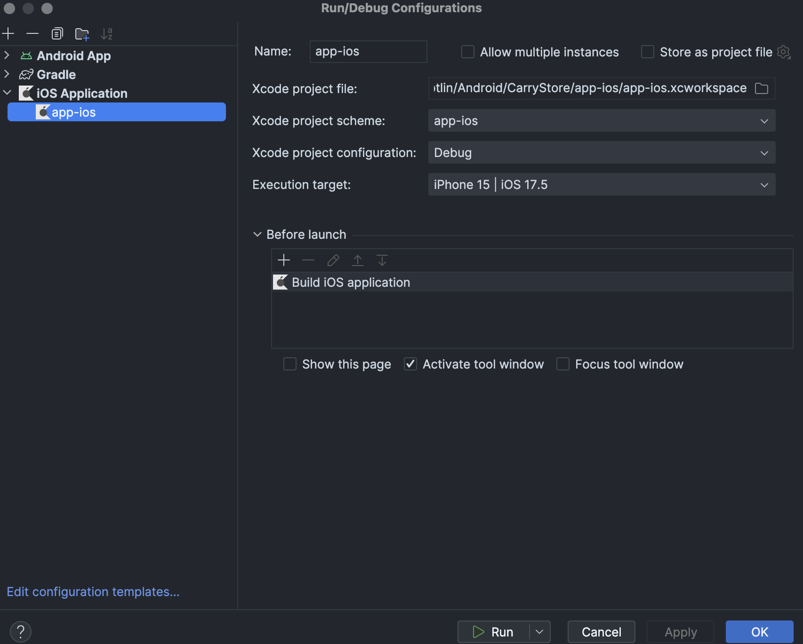
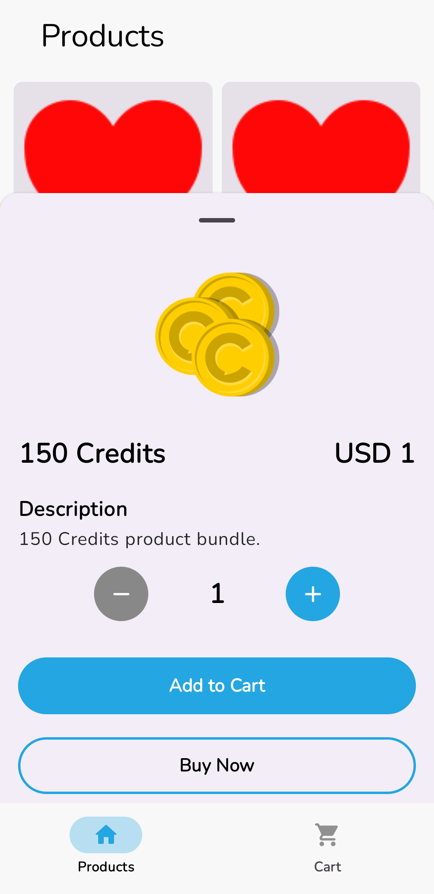
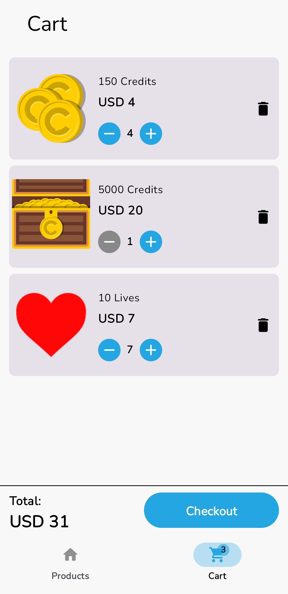
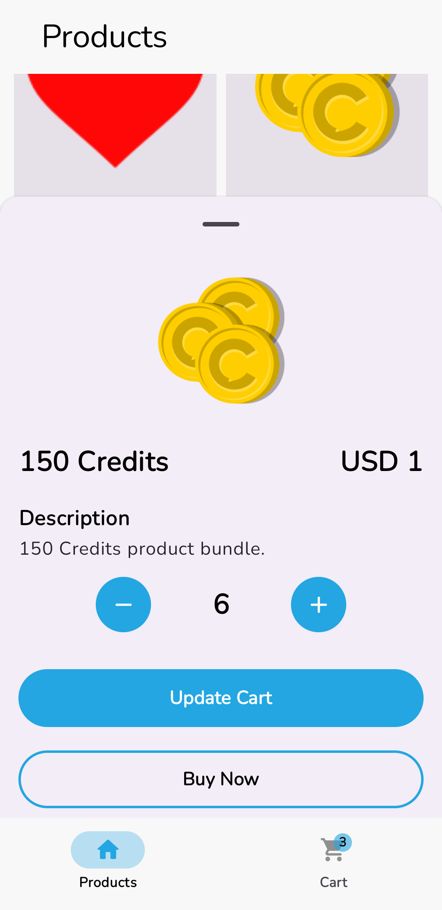
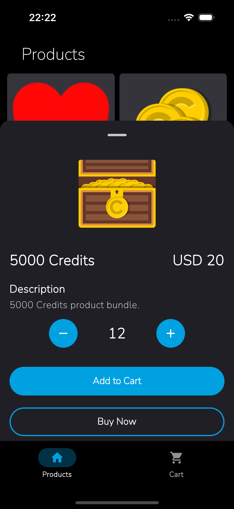
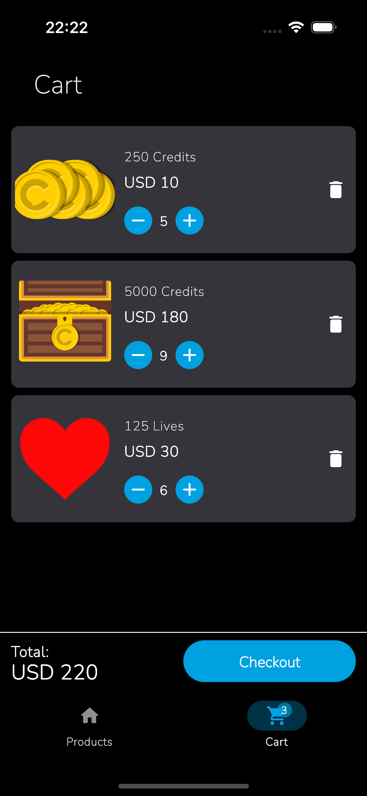
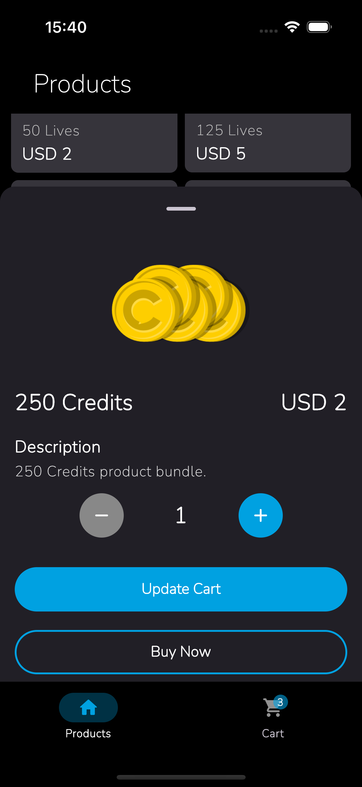

# CarryStore

This cross-platform e-commerce application leverages Kotlin Multiplatform and [Jetpack Compose Multiplatform](https://www.jetbrains.com/lp/compose-multiplatform/) to deliver a consistent user experience across Android and iOS devices. By consuming a [products API](https://my-json-server.typicode.com/carry1stdeveloper/mock-product-api/productBundles), the app efficiently fetches product data and enables users to effortlessly add items to their cart.

## Prerequisite

- [Android Studio](https://developer.android.com/studio) - For Android development and project management.
- [Xcode](https://apps.apple.com/us/app/xcode/id497799835)(Optional) - For iOS development and project management.
- [JDK](https://www.oracle.com/java/technologies/downloads/?er=221886) - Required for Android development.
- [Kotlin Multiplatform Plugin](https://kotlinlang.org/docs/multiplatform-plugin-releases.html?_gl=1*130bj1*_gcl_au*MTk1MDYwOTc4MS4xNzIxNjMzNjAy*_ga*MTM4NzQwMTA3NS4xNjk3NDg5MzQ5*_ga_9J976DJZ68*MTcyMzExNTUwNy43Ni4xLjE3MjMxMTU1OTYuNDQuMC4w#release-details)- In Android Studio, select Settings/Preferences | Plugins, search Marketplace for Kotlin Multiplatform, and then install it.

## Installation

### Android

- Open the project in Android Studio.
- Connect your physical device or open an emulator.
- Run the gradle command below from Android Studio terminal to build and install the android application on the connected android device/emulator.

```bash
./gradlew installDebug
```

The android application can also be downloaded via [Firebase App Distribution](https://firebase.google.com/docs/app-distribution).

<a href="https://appdistribution.firebase.dev/i/fbdf7f318b033002">
  
</a>

### iOS

- Navigate to __Run -> Edit__ Configurations in the Android Studio main menu.
- Click the plus sign and select __iOS Application__.
- Give the configuration a descriptive name then locate and select the __app-ios.xworkspace__ file in the ___app-ios___ module.
- Select the desired iOS simulator from the execution target list.

<p align="center">

</p>

<!-- The iOS application can also be downloaded via Firebase App Distribution

<a href="https://appdistribution.firebase.dev/i/fbdf7f318b033002">
  
</a> -->

### Screenshots

### Android

    

### iOS
    

## Project Structure
<!-- ToDo: Add project structure image -->

The application has three main module; ___[app-android](https://github.com/VictorKabata/CarryStore/tree/main/app-android)___, ___[app-ios](https://github.com/VictorKabata/CarryStore/tree/main/app-ios)___ and ___[shared](https://github.com/VictorKabata/CarryStore/tree/main/shared)___.

### app-android

The __app-android__ module serves as the entry point for the Android application. It houses the __build.gradle__ file for configuring the Android-specific build process, the __AndroidManifest.xml__ file defining the app's metadata, and the main __application class__. The primary responsibility of this module is to initialize the Android platform and load the shared Jetpack Compose UI components from the shared module.

### app-ios

The ___app-ios__ module contains Swift code responsible for bridging the shared Jetpack Compose UI components to the native iOS platform. The module includes the Podfile for managing dependencies and the App class serves as the entry point for the iOS application, initializing the content view and integrating any necessary platform-specific dependencies, such as Koin for dependency injection.

### shared

The shared module encapsulates cross-platform logic and jetpack compose UI components. It consists of four primary directories:

- __Domain:__ Defines the core business logic, including data classes representing app entities, repository interfaces for data access, and shared application constants.

- __Data:__ Handles data management, encompassing caching logic(using SQLDelight), network interactions(using Ktor), data transfer objects, data sources classes for mediating data access, and mappers for converting data between different layers.

- __UI:__ Houses the shared UI components, including the app's theme, navigation logic, and composable functions for building components and screens that are rendered identically on both Android and iOS.

- __DI:__ Contains the dependency injection setup, managing the creation and provision of dependencies throughout the application.

### Testing
This project prioritizes code quality and reliability through rigorous testing. Unit tests thoroughly examine individual components and functions, employing [kotlin.test](https://kotlinlang.org/api/latest/kotlin.test/) for shared code.

Integration tests ensure seamless collaboration between different project segments, encompassing both shared and platform-specific code.

Finally, UI tests guarantee a consistent and optimal user experience by thoroughly evaluating the app's interface on both Android and iOS platforms through the shared code.

To execute the project's tests and generate an aggregated test report, run the following gradle command from Android Studio:

```bash
./gradlew :allTests
```

To generate a comprehensive test report for the project, execute the following gradle command
```bash
./gradlew :shared:koverHtmlReport
```

### Libraries and tools
Some of the libraries and tools used in this project include:

- [Jetpack Compose Multiplatform](https://www.jetbrains.com/lp/compose-multiplatform): The UI framework used to build the application's user interface across platforms.
- [Kotlinx Coroutines](https://github.com/Kotlin/kotlinx.coroutines): Enables asynchronous programming for non-blocking operations.
- [Koin](https://insert-koin.io/): A dependency injection framework for managing dependencies across your application.
- [Ktor](https://ktor.io/docs/): A lightweight HTTP client for making network requests.
- [SqlDelight](https://cashapp.github.io/sqldelight/2.0.2/multiplatform_sqlite/): A Kotlin-based SQL database library with support for both Android and iOS.
- [Napier](https://github.com/AAkira/Napier): A lightweight logging library for debugging and monitoring your application.
- [Kotlinx Serialization](https://github.com/Kotlin/kotlinx.serialization): Facilitates data serialization and deserialization in a format-agnostic way.
- [Firebase](https://firebase.google.com/): The Android application leverages Firebase for essential functionalities. This includes Firebase Analytics for user tracking, Firebase Crashlytics for error reporting, and Firebase App Distribution for streamlined app distribution.
- [Ktlint](https://github.com/pinterest/ktlint): For enforcing code style consistency.
- [Detekt](https://github.com/detekt/detekt): For static code analysis and quality checks.
- [Native Cocoapods](https://kotlinlang.org/docs/native-cocoapods.html): For integrating iOS dependencies with CocoaPods.
- [Kotlinx Kover](https://github.com/Kotlin/kotlinx-kover): Measuring Kotlin code coverage on JVM and Android.

Some of the test libraries include:
- [Kotlin Test](https://kotlinlang.org/api/latest/kotlin.test/): The standard unit testing framework for Kotlin.
- [Compose UI Test](https://developer.android.com/reference/kotlin/androidx/compose/ui/test/package-summary): Allow for running UI tests for composables in the commom/shared code .
- [Turbine](https://github.com/cashapp/turbine): A library for testing flows in a structured and asynchronous manner.
- [AssertK](https://github.com/willowtreeapps/assertk): A set of assertion libraries for writing concise and readable tests.

This project employs [GitHub Actions](https://github.com/VictorKabata/CarryStore/actions) for CI/CD, automatically building and running tests for every pull request and a continous distribution workflow to deploy the Android application to Firebase App Distribution.

To ensure code quality, all changes to main or develop branches must be submitted through pull requests with successful builds and tests workflow execution.


